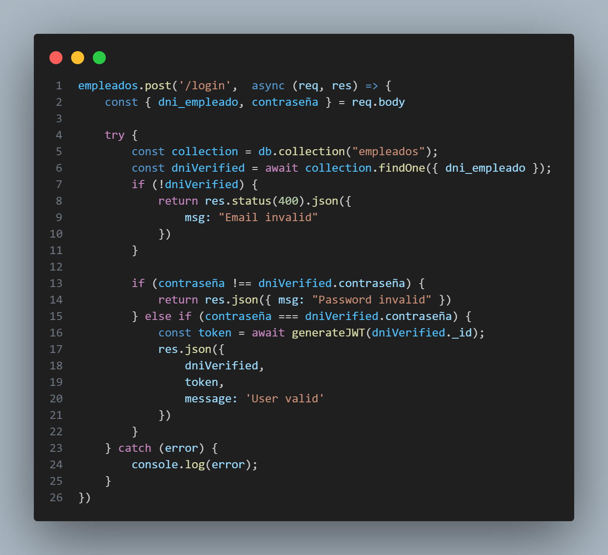

# Alquiler-Campuslands 🚗

Esta plataforma ha sido desarrollada utilizando las tecnologías de **Node.js, Express y MongoDB**, y está diseñada para ofrecer una gestión eficiente y bien organizada de alquileres de vehículos.


## Indicatorios


1. [¿Cómo usar el sistema?](#cómo-utilizar-el-software)

2. [Validación con JWT](#valicaciones-jwt)

3. [Rutas](#rutas)
- [Endpoints](#rutas)
- [Alquiler](#alquiler)
- [Automóviles](#automóviles)
- [Clientes](#clientes)
- [Empleados](#empleados)
- [Reservas](#reservas)
- [Sucursal Automóvil](#sucursal-automóvil)
- [Methods-CRUD](#methods-crud)
- [GET](#GET)
- [POST](#POST)
- [DELETE](#DELETE)
- [PUT](#PUT)


<br>

## ¿Cómo usar el sistema? 💻

Para poder usar este sistema en tu computador, tendrás que instalarlo y utilizarlo localmente, y necesitarás tener instalados los siguientes requisitos:


<div align="center"> Node.js 🚀 </div>
<br>


Para poder instalarlo, sigue los siguientes pasos:

1. Clona el repositorio: `https://github.com/Zachlesk/Alquiler-Campuslands.git`
`

2. Desde la terminal e instala las dependencias con el siguiente comando:

    ```bash
    npm update
    ```

3. Una vez instaladas las dependencias vamos a abrir una nueva terminal y ejecutamos el software:

    ```bash
    npm run zach
    ```

4. En la consola, visualizarás el siguiente mensaje: 
    ```bash
    Server is running on port ${PORT}
    ```
<br>
-> ¡Listo! Tu servidor está en funcionamiento.

<hr>

## Validación con JWT 🔰

Este proyecto implementa un sistema de alquiler de autos con una capa de seguridad robusta basada en JSON Web Tokens (JWT). Con JWT, podemos garantizar que solo los empleados autorizados tengan acceso a ciertas funcionalidades y rutas del sistema. Para lograr esto, hemos utilizado un middleware personalizado llamado validateJWT y funciones de ayuda definidas en el archivo helpers/token.

### Generación de Tokens de Usuario 👥
Para permitir que un empleado acceda al sistema, primero deben autenticarse. Esto se logra mediante un proceso de inicio de sesión donde se autentican con sus credenciales. Una vez que el empleado se autentica con éxito, se genera un token JWT que se utiliza para las solicitudes.

<div align="center">  </div>


### Middleware de validación de JWT ✅

El middleware validateJWT se utiliza en las rutas que requieren autenticación. Este middleware verifica si el token proporcionado es válido y si el usuario tiene los permisos adecuados para acceder a la ruta.

## Rutas 🔗

Ya tenemos corriendo nuestro servidor, pero ¿cómo ingresamos a la información almacenada en nuestra base de datos?. Pues aquí está la explicación de como ingresar a cada una de ellas:

<br>

## Endpoints 🛑

Se implementó operaciones con endpoints para que la empresa pueda tener un sistema centralizado y eficiente para gestionar todos sus procesos relacionados con el alquiler de autos, lo que mejorará la satisfacción de sus clientes y aumentará su competitividad en el mercado.

### Alquileres

- `http://localhost/8020/alquileres/disponibles` 👍 : Obtener todos los automóviles disponibles para alquiler.
- `http://localhost/8020/alquileres/activos` 👤 : Listar todos los alquileres activos junto con los datos de los clientes relacionados.
- `http://localhost/8020/alquileres/detalles/:id` 📑 : Obtener los detalles del alquiler con el ID_Alquiler específico.
- `http://localhost/8020/alquileres/costo/:id` 📈 : Obtener el costo total de un alquiler específico.
- `http://localhost/8020/alquileres/fecha` 📆 : Obtener los detalles del alquiler que tiene fecha de inicio en '2023-07-05'
- `http://localhost/8020/alquileres/datos` 👨‍💻: Obtener los datos de los clientes que realizaron al menos un alquiler.
- `http://localhost/8020/alquileres/cantidad` 📶 : Obtener la cantidad total de alquileres registrados en la base de datos. 
- `http://localhost/8020/alquileres/capacidad` 🆓 : Mostrar los automóviles con capacidad igual a 5 personas y que estén disponibles.
- `http://localhost/8020/alquileres/mediana` 🚘 : Listar los alquileres con fecha de inicio entre '2023-07-05' y '2023-07-10'.

  <br>

### Automoviles

- `http://localhost/8020/automoviles/capacidad` 5️⃣: Mostrar todos los automóviles con una capacidad mayor a 5
personas.

- `http://localhost/8020/automoviles/ordenar` 🚨: Listar todos los automóviles ordenados por marca y modelo.

  <br>

### Clientes

- `http://localhost/8020/clientes` 🧑‍🤝‍🧑: Consulta a todos los clientes.
- `http://localhost/8020/clientes/dni/:dni` 🪪: Listar los clientes con el DNI específico.

  <br>

### Empleados

- `http://localhost:8020/empleados/vendedor` 💲: Listar los empleados con el cargo de "Vendedor".
- `http://localhost:8020/empleados/administrativos` 👑: Mostrar los empleados con cargo de "Gerente" o "Asistente".

  <br>

### Reservas

- `http://localhost/8020/reservas/pendientes` ✒️: Mostrar todas las reservas pendientes con los datos del cliente
y el automóvil reservado.
- `http://localhost/8020/reservas/cliente` 📍:  Listar las reservas pendientes realizadas por un cliente específico.
- `http://localhost/8020/reservas/reservacion` 🧑‍🎓: Obtener los datos del cliente que realizó la reservación.

  <br>

### Sucursal

- `http://localhost/8020/sucursal/disponibles` ✅: Mostrar la cantidad total de automóviles disponibles en cada sucursal.
- `http://localhost/8020/sucursal/direccion` 🏠: Mostrar la cantidad total de automóviles en cada sucursal junto con su dirección.

  <br>
  
  
## Methods CRUD 🚦

Se implementó metodos CRUD (Create, Read, Update, Delete) para que la empresa pueda tener un sistema con implementaciones que  permitirá a los empleados registrar nuevos clientes, administrar la disponibilidad de automóviles en cada sucursal, realizar alquileres y reservas, y llevar un registro detallado de cada entrega y devolución de automóviles.

### GET ▶️

La operación GET se utiliza para recuperar información de las coleccion de la base de datos. A continuación, se especifican las rutas para utilizar esta operación de las colecciones disponibles:

- `http://localhost/8020/alquileres/get` 
- `http://localhost/8020/automoviles/get` 
- `http://localhost/8020/clientes/get` 
- `http://localhost/8020/empleados/get` 
- `http://localhost/8020/reservas/get` 
- `http://localhost/8020/sucursal/get` 

### POST

La operación POST se utiliza para crear un nuevo recurso en las colecciones. A continuación, se especifican las rutas para utilizar esta operación de agregación de nueva información de las colecciones disponibles:

- `http://localhost/8020/alquileres/post` 
- `http://localhost/8020/automoviles/post` 
- `http://localhost/8020/clientes/post` 
- `http://localhost/8020/empleados/post` 
- `http://localhost/8020/reservas/post` 
- `http://localhost/8020/sucursal/post` 

### POST ➕

La operación POST se utiliza para crear un nuevo recurso en las colecciones. A continuación, se especifican las rutas para utilizar esta operación de agregación de nueva información de las colecciones disponibles:

- `http://localhost/8020/alquileres/post` 
- `http://localhost/8020/automoviles/post` 
- `http://localhost/8020/clientes/post` 
- `http://localhost/8020/empleados/post` 
- `http://localhost/8020/reservas/post` 
- `http://localhost/8020/sucursal/post` 


### DELETE 🚫

La operación DELETE se utiliza para eliminar un recurso en las colecciones. A continuación, se especifican las rutas para utilizar esta operación de eliminación de información especifica con el id de lo que hay en las colecciones disponibles:

- `http://localhost/8020/alquileres/delete/:id` 
- `http://localhost/8020/automoviles/delete/:id` 
- `http://localhost/8020/clientes/delete/:id` 
- `http://localhost/8020/empleados/delete/:id` 
- `http://localhost/8020/reservas/delete/:id` 
- `http://localhost/8020/sucursal/delete/:id` 


### PUT ✏️

La operación PUT se utiliza para actualizar un recurso en las colecciones. A continuación, se especifican las rutas para utilizar esta operación de actualización de información especifica con el id de lo que hay en las colecciones disponibles:

- `http://localhost/8020/alquileres/put/:id` 
- `http://localhost/8020/automoviles/put/:id` 
- `http://localhost/8020/clientes/put/:id` 
- `http://localhost/8020/empleados/put/:id` 
- `http://localhost/8020/reservas/put:id` 
- `http://localhost/8020/sucursal/put/:id` 


### Contribuciones 

¡Agradecemos tus contribuciones al proyecto! Si deseas colaborar, sigue los siguientes pasos:

1. Crea un nuevo "branch" para tus cambios.

   ```shell
   git checkout -b mi-nueva-funcionalidad    
   ```

2. Realiza tus modificaciones y mejoras.

3. Haz un "commit" de tus cambios.

   ```shell
   git commit -m "Agrego nueva funcionalidad"      
   ```

4. Envía tus cambios al repositorio remoto.

   ```shell
   git push origin mi-nueva-funcionalidad    
   ```

4. Abre un "**Pull Request**" en GitHub para que revisemos tus cambios.

¡Gracias por contribuir al proyecto "Alquiler-Campuslands"! 